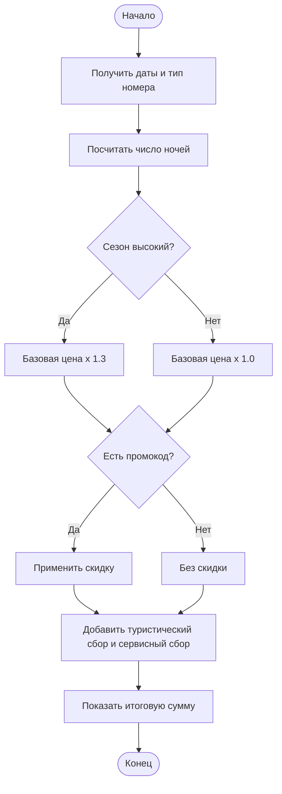

# Flowchart: расчёт стоимости проживания

Алгоритм расчёта итоговой суммы бронирования.

```mermaid
flowchart TD
    A([Начало]) --> B[Получить даты и тип номера]
    B --> C[Посчитать число ночей]
    C --> D{Сезон высокий?}
    D -->|Да| E[Базовая цена x 1.3]
    D -->|Нет| F[Базовая цена x 1.0]
    E --> G{Есть промокод?}
    F --> G
    G -->|Да| H[Применить скидку]
    G -->|Нет| I[Без скидки]
    H --> J[Добавить туристический сбор и сервисный сбор]
    I --> J
    J --> K[Показать итоговую сумму]
    K --> L([Конец])
```

