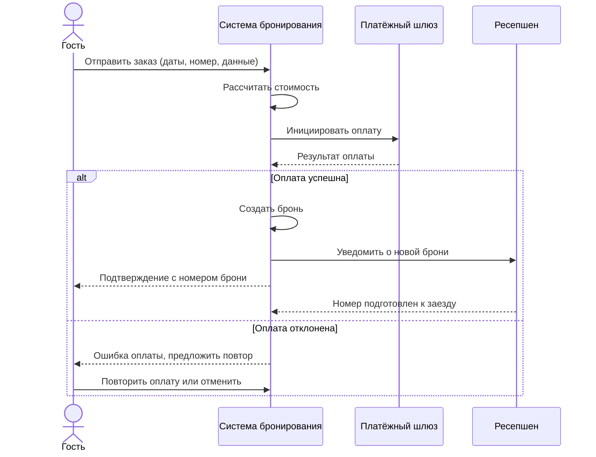

# Sequence Diagram: подтверждение бронирования

Сценарий обмена сообщениями при успешной оплате и уведомлении ресепшена.

```mermaid
sequenceDiagram
    actor Guest as Гость
    participant System as Система бронирования
    participant Pay as Платёжный шлюз
    participant Desk as Ресепшен

    Guest->>System: Отправить заказ (даты, номер, данные)
    System->>System: Рассчитать стоимость
    System->>Pay: Инициировать оплату
    Pay-->>System: Результат оплаты
    alt Оплата успешна
        System->>System: Создать бронь
        System->>Desk: Уведомить о новой брони
        System-->>Guest: Подтверждение с номером брони
        Desk-->>System: Номер подготовлен к заезду
    else Оплата отклонена
        System-->>Guest: Ошибка оплаты, предложить повтор
        Guest->>System: Повторить оплату или отменить
    end
```
